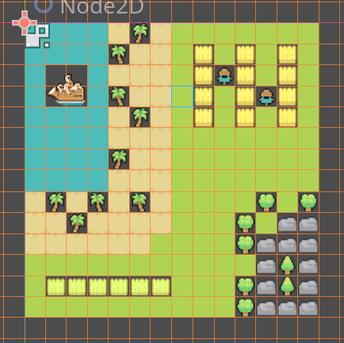
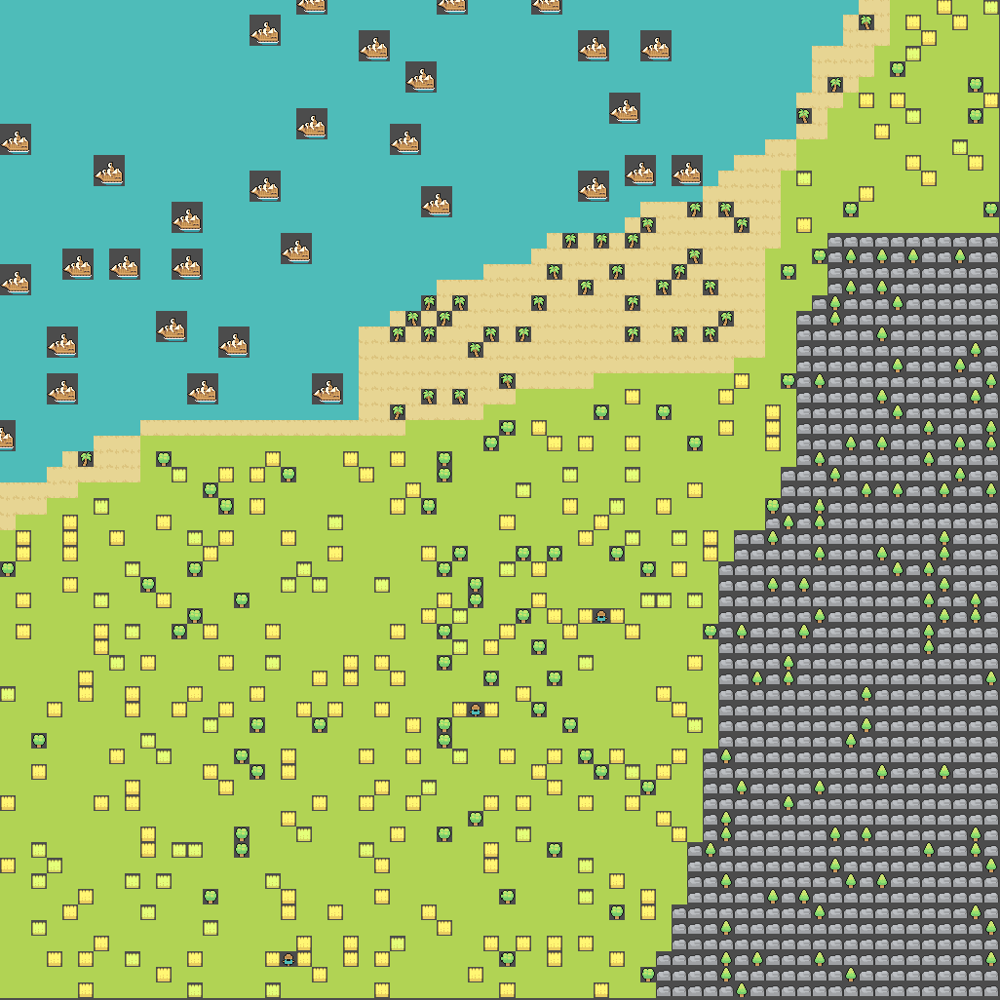

# TileMapGenerator (Godot GDExtension)

A procedural tile map generator with Godot 4 to explore the Wave Function Collapse algorithm (https://en.wikipedia.org/wiki/Model_synthesis). Implemented from scratch in C++ as a GDExtension module.

## Features

- Constraint-based tile placement via neighbor rules
- Considers direction, which allows multi-tiled objects to fit nicely with each other
- Uses only a sample tilemap (using Godot editor) as input, you don't need to manually specify which tiles go with each other
- Probability based generation - the more of one tile you give in the sample, the more likelier it shows up in the generated map
- BFS based propogation, which greatly diminishes contradiction chance for samples that make sense
- Visual step-by-step generation via `_process`
- Written in C++ for performance, using GDExtension

## Example Usage





## Dependencies

- Godot Engine 4.4+
- C++ compiler (MSVC, GCC, Clang, etc.)
- [godot-cpp](https://github.com/godotengine/godot-cpp) (included as a submodule)
- Python + SCons (for building)

## Setup

```bash
# Clone the repo
git clone --recurse-submodules https://github.com/JarretDi/procedural-map-generator.git
cd map-generator

# Build the extension
scons

# Alternatively:
python -m SCons
```

Then, open up demo/project.godot and run

## CREDITS:
	Tileset 1 by Shade from https://merchant-shade.itch.io/16x16-mini-world-sprites under Creative Commons Zero v1.0 Universal
    Tileset 2 by Beast Pixels from https://beast-pixels.itch.io/overworld-tileset-grass-biome under CC-0
